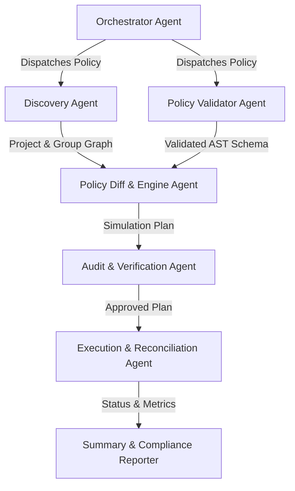

# Autonomous Agent Architecture & Guidelines

Welcome to the **GitLab Fleet Governor** autonomous agent orchestration specification. This document outlines the architectural paradigms, safety contracts, role models, and orchestration protocols for autonomous AI agents, CI/CD bots, and policy governance automation engines interacting with GitLab Fleet Governor.

---

## 1. Architectural Philosophy

GitLab Fleet Governor is engineered to serve as both a human-operated CLI tool and an autonomous policy governance agent. When operating autonomously across large-scale enterprise GitLab instances (spanning thousands of groups and repositories), agents must adhere to four foundational principles:

1. **Declarative Invariant Convergence**: Agents operate against declarative desired state (YAML/JSON policies). Every operation must be idempotent, converging actual fleet state toward desired state without side effects on repeated execution.
2. **Simulation Before Mutation (Dry-Run First)**: Autonomous workflows must default to non-destructive simulation (`--dry-run` or `settings.dry_run: true`). Mutating execution must only occur when explicitly scheduled or authorized.
3. **Transport Resilience & Rate Politeness**: Autonomous agents must strictly respect GitLab instance rate limits, employing token-bucket proactive throttling and jittered exponential backoff on HTTP 429 and 5xx responses.
4. **Zero-Trust Credential Masking**: Tokens, secrets, and private variables must never be emitted into logs, summary reports, or agent communication channels.

---

## 2. Multi-Agent Role Topology

Enterprise fleet governance can be partitioned across specialized autonomous agent roles:



### Agent Roles

| Role | Primary Responsibility | Key Interfaces |
|---|---|---|
| **Orchestrator** | Coordinates policy schedules, manages execution lifecycles, handles event triggers (EventBridge, Webhooks). | `cmd/gitlab-fleet-governor run`, AWS Lambda handler |
| **Validator** | Validates YAML/JSON schemas, RE2 regular expressions, GitLab access levels, and enum bounds offline. | `internal/cli/validate.go`, `internal/config` |
| **Discovery** | Recursively traverses group hierarchies using BFS with cycle detection and applies project filtering pipelines. | `internal/discovery` |
| **Engine / Diff** | Compares desired policy state against remote GitLab entity configurations to calculate minimal diff sets. | `internal/engine`, `internal/operations` |
| **Reconciler** | Executes parallel, bounded-concurrency worker pools to apply mutations with backoff retries. | `internal/client`, `internal/engine` |
| **Auditor** | Generates non-repudiable audit trails, verifies compliance frameworks, and flags unmanaged drift. | `internal/reporter`, `internal/operations/compliance` |

---

## 3. Safe Autonomous Execution Lifecycle

Autonomous agents executing governance workflows follow a strict 5-phase lifecycle:

```
[Phase 1: Ingestion & Validation]
         │
         ▼
[Phase 2: Topology Discovery]
         │
         ▼
[Phase 3: Diff & Dry-Run Evaluation]
         │
         ▼
[Phase 4: Reconciled Mutation]
         │
         ▼
[Phase 5: Attestation & Reporting]
```

### Phase 1: Ingestion & Offline Validation
- Agent loads policy definitions from local files, S3 buckets, or standard input.
- Environment variable substitution is evaluated (`${ENV_VAR}` and `${ENV_VAR:-default}`).
- Schema, RE2 regular expressions, and constraint validators execute offline without making remote API calls:
  ```bash
  gitlab-fleet-governor validate -c /path/to/policy.yaml --json
  ```
- If validation fails, execution halts immediately with structured error output.

### Phase 2: Topology Discovery
- Agent discovers candidate groups and projects matching configured selectors:
  - Numeric Group IDs (`group_ids_include`)
  - Hierarchy paths (`group_paths_include`) with recursive BFS traversal and visited-set cycle detection
  - Project filters (namespace matching, project name regex, visibility, archived flags, topic tags, ID ranges)
- Paging uses keyset pagination (`id_after`) where supported to eliminate deep offset degradation.

### Phase 3: Diff & Dry-Run Evaluation
- For each targeted project or group, the agent inspects current state and determines whether updates are required.
- In dry-run mode, all proposed mutations are logged with before/after state without performing mutating API calls (`POST`, `PUT`, `DELETE`).
- A dry-run report is generated in table, JSON, CSV, or Markdown format.

### Phase 4: Reconciled Mutation
- When dry-run is disabled (`--dry-run=false` or `settings.dry_run: false`), worker pools execute mutations.
- Concurrency is bounded by channel-based semaphore (`--concurrency=N`).
- Operations check for existence (e.g., `GET /projects/:id/push_rule` $\to$ 404 $\to$ `POST` vs 200 $\to$ `PUT`) to ensure idempotency.

### Phase 5: Attestation & Reporting
- Execution summaries aggregate totals for scanned, matched, applied, skipped, and failed operations.
- Non-zero error counts trigger alerts or structured JSON event dispatches for monitoring systems.

---

## 4. Operational Safety Guidelines for Autonomous Systems

### 1. Concurrency and Rate Limits
- Always configure `settings.gitlab.rate_limit_rps` (default: `30.0`) and `settings.gitlab.rate_limit_burst` (default: `50`) according to your GitLab instance tier (SaaS vs Self-Managed).
- For large instances (>5,000 repositories), recommend concurrency between 10 and 25 workers to prevent socket starvation.

### 2. Error Recovery and Resilience
- Transient failures (HTTP 429 Too Many Requests, HTTP 500, 502, 503, 504) are automatically retried up to `max_retries` (default: 3) with exponential backoff (`retry_base_delay_ms: 500`) and jitter.
- Terminal errors (401 Unauthorized, 403 Forbidden, 400 Bad Request) fail fast per entity and are logged in the summary report without aborting the entire fleet scan.

### 3. Least Privilege Access
Autonomous agents should authenticate using a scoped GitLab Access Token:
- **Scope Requirements**: `api` (for full governance) or `read_api` (for read-only compliance scanning).
- Prefer **Group Access Tokens** or **Project Access Tokens** over personal access tokens (PATs) where possible.
- Never commit access tokens to repositories; pass via `GITLAB_TOKEN`, `CI_JOB_TOKEN`, or AWS Secrets Manager.

### 4. Serverless / EventBridge Autonomous Runs
For automated periodic runs on AWS Lambda:
- Configure an EventBridge schedule (e.g., `cron(0 2 * * ? *)` for nightly governance).
- Pass configuration via S3 URI (`s3://my-governance-bucket/policies/production.yaml`) to allow centralized policy management without redeploying code.

---

## 5. Agent Integration Interfaces

### CLI Command Matrix for Automation

| Action | Machine-Readable Command | Exit Codes |
|---|---|---|
| Syntax Check | `gitlab-fleet-governor validate -c policy.yaml --json` | `0` = Valid, `1` = Invalid / Error |
| Dry Run Diff | `gitlab-fleet-governor run -c policy.yaml --dry-run --report-format json` | `0` = Success, `1` = Error |
| Enforce Policy | `gitlab-fleet-governor run -c policy.yaml --dry-run=false --report-format json` | `0` = Success, `1` = Partial/Total Error |
| Version Check | `gitlab-fleet-governor version --json` | `0` = Success |

### Structured Log Parsing
When running in automated environments, set `--log-format json` to stream newline-delimited JSON logs to stdout:
```json
{"time":"2026-08-25T19:30:00Z","level":"INFO","msg":"starting governance reconciliation","dry_run":true,"concurrency":10}
{"time":"2026-08-25T19:30:01Z","level":"INFO","msg":"project matched selectors","project":"core/payments","id":101}
```

---

## 6. Project Layout & Architecture

```
cmd/gitlab-fleet-governor/  # Dual-mode CLI and AWS Lambda entrypoint
internal/
  cli/                      # Cobra subcommands (run, validate, lambda, version)
  config/                   # YAML/JSON policy parsing, envsubst substitution, schema validation
  discovery/                # Group BFS hierarchy traversal with cycle detection & project filtering
  engine/                   # Parallel worker pool reconciler & diff calculation engine
  gitlab/                   # Resilient GitLab REST API client (rate limiting, jittered backoff)
  governance/               # 10 modular reconciler engines (push_rules, protected_branches, etc.)
  lambda/                   # AWS Lambda event drivers (EventBridge, S3 Put, Direct JSON)
  logging/                  # Structured log/slog handler (text/json formatting)
  report/                   # Multi-format report renderer (table, json, csv, markdown)
pkg/version/                # Release Please versioning and build metadata
```

---

## 7. Ecosystem Best Practices & Verification

### Coding Conventions
- **Structured Logging**: Standard library `log/slog` for all log emissions with contextual attributes.
- **Error Handling**: Wrap errors using `fmt.Errorf("...: %w", err)` for actionable stack traces.
- **Context Propagation**: Always propagate `context.Context` through all API client calls and reconciler phases.
- **Dry-Run Safety**: Every reconciler operation MUST check `dryRun bool` and skip mutating calls (`POST`, `PUT`, `DELETE`).

### Verification Commands
```bash
make fmt          # Format Go code with gofmt and goimports
make lint         # Run golangci-lint static analysis
make test         # Run unit & integration tests with race detector
make build        # Build host binary in bin/gitlab-fleet-governor
make build-lambda # Compile AWS Lambda custom runtime bootstrap zip
```

---

## 8. Community & Agent Collaboration

We encourage the open-source community to build agent extensions, custom operations, and event drivers. When submitting pull requests that affect autonomous execution paths:
- Ensure all new operations implement both inspection (`GET`) and mutation (`POST`/`PUT`/`DELETE`) logic.
- Include unit tests with mock GitLab API responders simulating transient errors and rate limits.
- Confirm full compliance with `go test -v -race -cover ./...` and `golangci-lint run ./...`.

