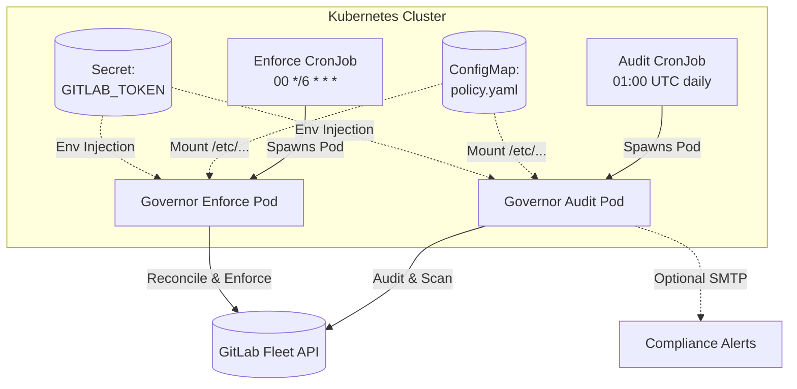

# Kubernetes Deployment & CronJob Automation

This directory provides production-grade manifests for deploying **GitLab Fleet Governor** on Kubernetes as scheduled CronJobs.

---

## Architecture Overview



- **`cronjob-audit.yaml`**: Executes compliance and security posture audits (`gitlab-fleet-governor audit`) on a daily schedule.
- **`cronjob-enforce.yaml`**: Continuously reconciles declarative policies against remote GitLab projects and groups (`gitlab-fleet-governor run --dry-run=false`).
- **`configmap.yaml`**: Stores the declarative policy configuration file mounted into pods.
- **`secret-template.yaml`**: Template for injecting the GitLab API token and optional SMTP credentials.
- **`serviceaccount.yaml`**: Dedicated non-root ServiceAccount with optional AWS IRSA or GCP Workload Identity annotations.

---

## Security Hardening Features

All manifests enforce enterprise container security best practices:
- **Non-Root Execution**: Runs under UID `10001` (`appuser`).
- **Read-Only Root Filesystem**: Pod root filesystem is mounted read-only (`readOnlyRootFilesystem: true`), using temporary writable `emptyDir` volumes on `/tmp` and `/reports`.
- **Privilege Dropping**: Drops all Linux capabilities (`capabilities: drop: ["ALL"]`).
- **Seccomp Profile**: Configured with `RuntimeDefault`.
- **Concurrency Control**: Configured with `concurrencyPolicy: Forbid` to prevent duplicate parallel scans.

---

## Quickstart Deployment

### 1. Create the Namespace & Secret

```bash
# Create the secret directly from your command line
kubectl create secret generic gitlab-fleet-governor-secret \
  --from-literal=GITLAB_TOKEN="glpat-YOUR_ACCESS_TOKEN" \
  --from-literal=GITLAB_BASE_URL="https://gitlab.com/api/v4" \
  --from-literal=FLEET_LICENSE_KEY="YOUR_COMMERCIAL_LICENSE_TOKEN" # Optional: for >25 production projects
```

### 2. Customize the Policy ConfigMap

Edit `deploy/kubernetes/configmap.yaml` with your group targets, project filters, and desired governance rules.

### 3. Deploy with Kustomize or kubectl

```bash
# Using Kustomize
kubectl apply -k deploy/kubernetes/

# Or using plain kubectl
kubectl apply -f deploy/kubernetes/serviceaccount.yaml
kubectl apply -f deploy/kubernetes/configmap.yaml
kubectl apply -f deploy/kubernetes/cronjob-audit.yaml
kubectl apply -f deploy/kubernetes/cronjob-enforce.yaml
```

---

## Manual Ad-Hoc Triggering

You can immediately trigger a run from an existing CronJob without waiting for the scheduled time:

```bash
# Trigger immediate audit job
kubectl create job --from=cronjob/gitlab-fleet-governor-audit manual-audit-01

# Stream the logs
kubectl logs -f job/manual-audit-01
```

---

## Secret Management Integrations

For GitOps workflows (ArgoCD, Flux), use:
- **External Secrets Operator (ESO)** with AWS Secrets Manager, GCP Secret Manager, or HashiCorp Vault.
- **Sealed Secrets** for encrypting `secret-template.yaml` directly into your Git repository.
