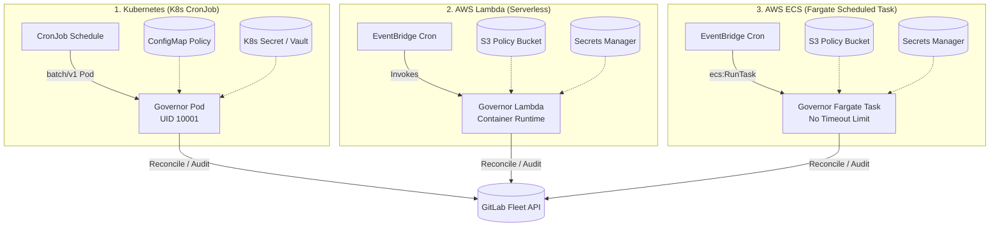

# Deployment & Fleet Automation Guide

GitLab Fleet Governor is engineered for automated, hands-off governance across three primary cloud-native deployment patterns:

1. **Kubernetes CronJobs**: Ideal for organizations running Kubernetes (EKS, GKE, AKS, or self-hosted) with GitOps (ArgoCD, Flux).
2. **AWS Lambda (Serverless)**: Ideal for event-driven governance and lightweight periodic runs (fleets under 1,000 repositories).
3. **AWS ECS Fargate**: Ideal for large enterprise fleets (>1,000 to >10,000 repositories) where scans require more than Lambda's 15-minute timeout.

---

## Deployment Architecture Comparison



| Deployment Model | Best For | Max Execution Time | Config Source | Secrets Management |
|---|---|---|---|---|
| **Kubernetes CronJob** | Self-hosted & Cloud K8s clusters | Unlimited | ConfigMap or S3 URI | K8s Secret, Vault, ESO |
| **AWS Lambda** | Event-driven serverless runs | 15 minutes | S3 URI or Event payload | AWS Secrets Manager |
| **AWS ECS Fargate** | Large fleets (>1,000 repos) | Unlimited | S3 URI or Volume | AWS Secrets Manager |

---

## 1. Kubernetes Deployment (CronJob)

Production manifests are located in [`deploy/kubernetes/`](https://github.com/divmora/gitlab-fleet-governor/tree/main/deploy/kubernetes).

### Components

- **`cronjob-audit.yaml`**: Runs daily compliance posture audits (`audit` subcommand) and outputs Excel or JSON summaries.
- **`cronjob-enforce.yaml`**: Reconciles fleet configurations against desired state (`run --dry-run=false`).
- **`configmap.yaml`**: Mounts `policy.yaml` into containers at `/etc/gitlab-fleet-governor/`.
- **`serviceaccount.yaml`**: Non-root service account with optional Cloud IAM IRSA annotations.

### Quickstart with kubectl

```bash
# 1. Create the GitLab API token secret
kubectl create secret generic gitlab-fleet-governor-secret \
  --from-literal=GITLAB_TOKEN="glpat-YOUR_ACCESS_TOKEN" \
  --from-literal=GITLAB_BASE_URL="https://gitlab.com/api/v4"

# 2. Deploy all manifests via Kustomize
kubectl apply -k deploy/kubernetes/
```

### Manual Trigger

```bash
# Trigger an immediate run without waiting for cron schedule
kubectl create job --from=cronjob/gitlab-fleet-governor-audit manual-audit-01
kubectl logs -f job/manual-audit-01
```

---

## 2. AWS Lambda Serverless Deployment

Official AWS CloudFormation templates are maintained in [`cloudformation-templates/gitlab-fleet-governor/`](https://github.com/divmora/cloudformation-templates/tree/main/gitlab-fleet-governor).

### Dual-Runtime Auto-Detection

When deployed to AWS Lambda, `cmd/gitlab-fleet-governor/main.go` automatically detects `AWS_LAMBDA_FUNCTION_NAME` and shifts from CLI mode to the serverless runtime adapter (`lambda.Start`).

### Deploying via AWS CloudFormation CLI

```bash
aws cloudformation deploy \
  --template-file ../cloudformation-templates/gitlab-fleet-governor/gitlab-fleet-governor-lambda.yaml \
  --stack-name gitlab-fleet-governor-lambda \
  --capabilities CAPABILITY_NAMED_IAM \
  --parameter-overrides \
    GitLabTokenSecretArn="arn:aws:secretsmanager:us-east-1:123456789012:secret:gitlab-token-xxxx" \
    ConfigS3Uri="s3://my-governance-bucket/policies/production.yaml" \
    ScheduleCron="cron(0 2 * * ? *)"
```

---

## 3. AWS ECS Fargate Deployment

Official AWS CloudFormation templates for ECS Fargate scheduled tasks are maintained in [`cloudformation-templates/gitlab-fleet-governor/`](https://github.com/divmora/cloudformation-templates/tree/main/gitlab-fleet-governor).

### Why ECS for Large Fleets?

Scanning 5,000+ repositories with deep branch protection analysis, merge request approval rules, and member crawling may exceed AWS Lambda's 15-minute threshold. ECS Fargate allows tasks to run indefinitely with configurable CPU (0.25 to 16 vCPUs) and RAM (0.5 to 120 GB).

### Deploying via AWS CloudFormation CLI

```bash
aws cloudformation deploy \
  --template-file ../cloudformation-templates/gitlab-fleet-governor/gitlab-fleet-governor-ecs-fargate.yaml \
  --stack-name gitlab-fleet-governor-ecs \
  --capabilities CAPABILITY_NAMED_IAM \
  --parameter-overrides \
    VpcId="vpc-0123456789abcdef0" \
    SubnetIds="subnet-0123456789abcdef0,subnet-0abcdef0123456789" \
    GitLabTokenSecretArn="arn:aws:secretsmanager:us-east-1:123456789012:secret:gitlab-token-xxxx" \
    ConfigS3Uri="s3://my-governance-bucket/policies/production.yaml" \
    ScheduleCron="cron(0 2 * * ? *)"
```

### Manual Trigger via AWS CLI

```bash
aws ecs run-task \
  --cluster gitlab-fleet-governor-cluster-prod \
  --task-definition gitlab-fleet-governor-prod \
  --launch-type FARGATE \
  --network-configuration "awsvpcConfiguration={subnets=[subnet-0123456789abcdef0],assignPublicIp=ENABLED}"
```
