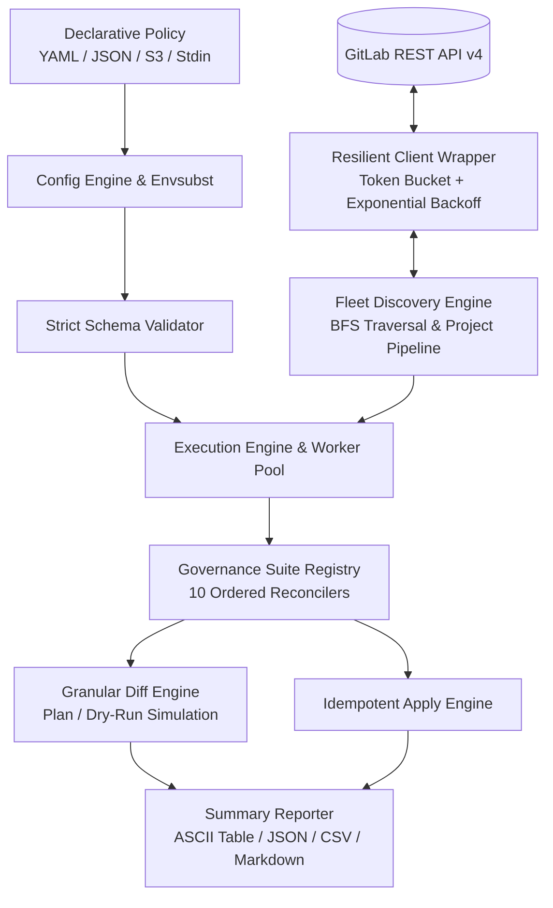

# GitLab Fleet Governor

**GitLab Fleet Governor** (`gitlab-fleet-governor`) is a production-grade, declarative policy-as-code governance automation engine written in Go. It enables platform engineering, security, and DevSecOps teams to continuously discover, audit, diff, and enforce standardized governance policies across thousands of GitLab projects and subgroups.

---

## Key Features

- **Declarative Policy-as-Code**: Author governance baselines in human-friendly YAML or JSON with full environment variable interpolation (`${VAR:-default}`).
- **Fleet-Scale Discovery**: Recursive Breadth-First Search (BFS) group hierarchy discovery with cycle detection, alongside multi-criteria project filter pipelines (namespaces, regexes, topics, visibility, ID ranges).
- **Comprehensive Governance Suite (10 Reconcilers)**:
  1. **Push Rules**: Author emails, branch naming, commit messages, file size caps, secrets scanning, signed commit requirements, and DCO enforcement.
  2. **Protected Branches**: Branch wildcards, push/merge/unprotect access tiers, force push bans, code owner approvals.
  3. **MR Approval Rules**: General approval settings, named rule matrices, user/group handle resolution, and unmanaged rule pruning.
  4. **Project Settings**: Merge strategies, squash options, discussion resolution gates, pipeline artifact retention.
  5. **Pipeline Retention**: Automated GitLab CI pipeline cleanup (`retention_days` converted to `ci_delete_pipelines_in_seconds`).
  6. **CI/CD Variables & Secrets**: Scoped environment variables, masked secrets, protected flags, raw values, and drift pruning.
  7. **Runner Governance**: Shared/group runner controls, tag assertions, maintenance lock/pause status.
  8. **Compliance Frameworks**: Automated assignment and drift remediation for compliance labels (SOC2, PCI-DSS, ISO27001, HIPAA).
  9. **Webhooks & Integrations**: Fleet webhook provisioning, trigger matrix, HMAC secret tokens, SSL verification.
  10. **Member & Access Audit**: Over-privileged user detection, mandatory expiration dates, inherited maintainer cleanup.
- **Resilient API Engine**: Built on `gitlab.com/gitlab-org/api/client-go` with proactive token-bucket rate limiting (RPS/burst), reactive exponential backoff with full jitter for HTTP 429/5xx, and transparent keyset (`id_after`) streaming pagination.
- **Dual Runtime Architecture**: Runs seamlessly as a local/CI CLI binary, a multi-arch container (`ghcr.io/divmora/gitlab-fleet-governor`), or an AWS Lambda function with runtime auto-detection.
- **Safety by Default**: Simulates changes via `--dry-run` (default: `true`), producing granular attribute-level diffs ($S_D \ominus S_L$) before applying mutations.
- **Rich Multi-Format Reporting**: Outputs colored ASCII terminal tables, structured JSON, CSV, and Markdown audit summaries.

---

## Architecture Overview

---

## Quick Navigation

- [Getting Started](getting-started.md): Installation, authentication, and running your first simulation.
- [Configuration Guide](configuration.md): Complete reference for policy YAML/JSON schemas.
- [Operations Guide](operations.md): In-depth mechanics of all 10 governance reconcilers.
- [AWS Lambda Deployment](lambda.md): Serverless cron and event-driven automation.
- [CI/CD Integration](ci-cd.md): Automated governance in GitLab CI and GitHub Actions.
- [Architecture Details](architecture.md): Internal concurrency, rate limiting, and design principles.
