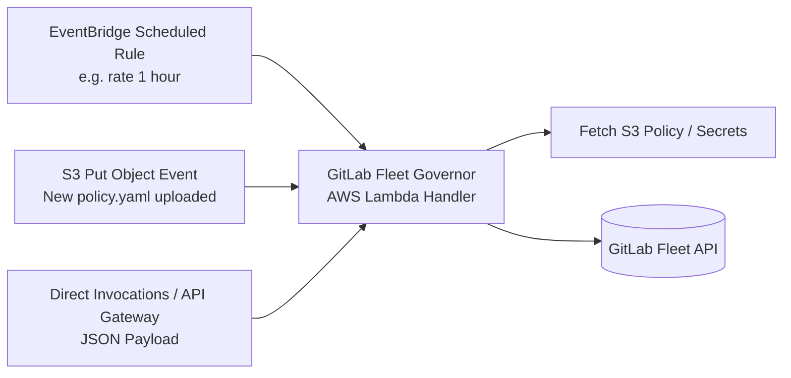

# AWS Lambda & Serverless Execution

GitLab Fleet Governor is engineered with dual runtime support. When deployed to AWS Lambda, it automatically detects the Lambda runtime environment and executes seamlessly without code changes.

---

## Runtime Auto-Detection

The application inspects the environment at startup:
- If `AWS_LAMBDA_FUNCTION_NAME` is set, `cmd/gitlab-fleet-governor/main.go` bypasses the CLI and invokes the AWS Lambda Go runtime adapter (`lambda.Start(handler.HandleRequest)`).
- If `AWS_LAMBDA_FUNCTION_NAME` is absent, standard Cobra CLI processing proceeds.

---

## Supported Event Triggers

The Lambda handler processes three trigger patterns:



### 1. Amazon EventBridge (CloudWatch Events) Scheduled Cron

Schedule periodic fleet audits (e.g. every hour):

```json
{
  "version": "0",
  "id": "53dc4d37-c2fc-431f-96b3-103dd95980e0",
  "detail-type": "Scheduled Event",
  "source": "aws.events",
  "account": "123456789012",
  "time": "2026-08-26T00:00:00Z",
  "region": "us-east-1",
  "resources": [
    "arn:aws:events:us-east-1:123456789012:rule/hourly-gitlab-governance"
  ],
  "detail": {}
}
```

Configuration is loaded from environment variables (`CONFIG_SOURCE=s3://my-corp-policies/governance.yaml`).

### 2. Amazon S3 Put Object Event

Automatically audit or enforce policies whenever a policy YAML/JSON file is uploaded to an S3 bucket:

```json
{
  "Records": [
    {
      "eventVersion": "2.1",
      "eventSource": "aws:s3",
      "awsRegion": "us-east-1",
      "eventTime": "2026-08-26T00:00:00.000Z",
      "eventName": "ObjectCreated:Put",
      "s3": {
        "s3SchemaVersion": "1.0",
        "configurationId": "PolicyUploadRule",
        "bucket": {
          "name": "my-corp-policies",
          "arn": "arn:aws:s3:::my-corp-policies"
        },
        "object": {
          "key": "production/governance.yaml",
          "size": 2048,
          "eTag": "b10a8db164e0754105b7a99be72e3fe5",
          "sequencer": "0A1B2C3D4E5F678901"
        }
      }
    }
  ]
}
```

### 3. Direct JSON Invocation Payload

Pass inline policy configurations or target overrides directly to the Lambda function:

```json
{
  "config_s3_uri": "s3://my-corp-policies/governance.yaml",
  "dry_run": true,
  "concurrency": 16,
  "log_level": "info",
  "group_paths_include": ["my-org/fintech"]
}
```

---

## Standardized Lambda Response Envelope

All Lambda invocations return a structured response envelope:

```json
{
  "statusCode": 200,
  "status": "SUCCESS",
  "event_type": "EVENTBRIDGE_SCHEDULED",
  "config_source": "s3://my-corp-policies/governance.yaml",
  "dry_run": true,
  "summary": {
    "scanned_groups": 12,
    "matched_groups": 12,
    "scanned_projects": 145,
    "matched_projects": 145,
    "applied_operations": 0,
    "skipped_operations": 0,
    "failed_operations": 0
  },
  "metrics": {
    "total_scanned": 145,
    "total_targeted": 145,
    "total_changed": 18,
    "total_unchanged": 127,
    "total_failed": 0,
    "duration": 4250000000
  },
  "errors": [],
  "execution_duration_ms": 4250
}
```

---

## Local Lambda Emulation via CLI

You can test the Lambda handler locally using the `lambda` CLI subcommand:

```bash
gitlab-fleet-governor lambda --event examples/lambda-event.json
```
