# GitLab Fleet Governor: Subscription Plans & Feature Matrix

This document outlines the subscription plan architecture, feature entitlement matrix, and operational terms for **GitLab Fleet Governor**.

---

## 1. Product Philosophy: Developer-First & Enterprise-Monetizable

GitLab Fleet Governor is engineered with a dual mandate:

1. **Frictionless Day-to-Day Developer Hygiene (Community Tier)**:
   Individual developers, open-source maintainers, and small engineering teams should never encounter licensing friction, token setup hurdles, or telemetry gates for daily repository governance. Standard repository hygiene (push rules, protected branches, general project settings, membership permissions, CI/CD variables, and CLI reporting) is **inherently free** and **completely unencumbered**.
2. **Zero-Check Guarantee for Community Capabilities**:
   When an execution exercises only Community Tier capabilities, the governance engine **bypasses all license verification and feature assertion functions entirely**. Zero remote calls, zero cryptographic signature verifications, and zero licensing overhead.
3. **High-Value Enterprise GRC Monetization (Pro & Enterprise Plans)**:
   Mid-market engineering teams unlock advanced CI/CD collaboration and automation at predictable team-scale pricing (**Pro Plan**), while enterprise security, audit trails, executive reporting, and autonomous cloud orchestration reside in the **Enterprise Plan**.

---

## 2. Subscription Plans Overview

```mermaid
flowchart LR
    subgraph Community["Free Community Tier"]
        C1["Zero License Checks"]
        C2["BSL 1.1 Fleet <= 25 Projects"]
        C3["Baseline Git Hygiene"]
    end

    subgraph Pro["Pro Subscription"]
        P1["MR Approval Review Gates"]
        P2["MR Target Branch Rules"]
        P3["Runner Fleet Governance"]
        P4["Webhook Automation"]
        P5["Pipeline History Retention"]
        P6["Extended Team Fleets (> 25)"]
    end

    subgraph Enterprise["Enterprise Subscription"]
        E1["Compliance Audit Suite"]
        E2["Executive Multi-Sheet Excel Workbooks"]
        E3["Headless SMTP Email Dispatch"]
        E4["GitLab Ultimate Compliance Frameworks"]
        E5["AWS Lambda 24/7 Serverless Runtime"]
        E6["Wildcard Entitlement (*)"]
    end

    Community --> Pro --> Enterprise
```



### Plan Summary

| Plan | Target Audience | Scaling Limit | Key Focus |
|---|---|---|---|
| **Free Community Tier** | Developers, Open Source, Small Teams | Up to 25 Projects | Unencumbered daily repo hygiene & simulation |
| **Pro Plan** | Engineering Teams, Tech Leads, Growing Startups | Custom / Quota-based | CI/CD automation, MR reviews, webhooks, runners |
| **Enterprise Plan** | Enterprise SecOps, CISO, GRC Teams | Unlimited Fleets | Full compliance audit, executive Excel, SMTP, Lambda |

---

## 3. Comprehensive Feature Entitlement Matrix

The following table details feature availability and runtime verification mechanics across all tiers:

| Capability / Module | Feature Identifier | Community Tier (Free BSL) | Pro Plan | Enterprise Plan | License Check Function Behavior |
|---|---|:---:|:---:|:---:|---|
| **Push Rules Reconciler** | `governance.push_rules` | ✅ Included | ✅ Included | ✅ Included | **Bypassed (Zero Calls)** |
| **Protected Branches** | `governance.protected_branches` | ✅ Included | ✅ Included | ✅ Included | **Bypassed (Zero Calls)** |
| **Project Settings** | `governance.project_settings` | ✅ Included | ✅ Included | ✅ Included | **Bypassed (Zero Calls)** |
| **Members & Expiration** | `governance.members` | ✅ Included | ✅ Included | ✅ Included | **Bypassed (Zero Calls)** |
| **CI/CD Variables** | `governance.variables` | ✅ Included | ✅ Included | ✅ Included | **Bypassed (Zero Calls)** |
| **Standard CLI Reports (table/json/csv/md)** | `report.*` | ✅ Included | ✅ Included | ✅ Included | **Bypassed (Zero Calls)** |
| **Merge Request Approval Rules** | `governance.approval_rules` | ❌ | ✅ Included | ✅ Included | Validated via `claims.AssertFeature` |
| **Merge Request Target Branch Rules** | `governance.target_branch_rules` | ❌ | ✅ Included | ✅ Included | Validated via `claims.AssertFeature` |
| **CI/CD Runner Fleet Governance** | `governance.runners` | ❌ | ✅ Included | ✅ Included | Validated via `claims.AssertFeature` |
| **Webhook Integrations & Security** | `governance.webhooks` | ❌ | ✅ Included | ✅ Included | Validated via `claims.AssertFeature` |
| **Pipeline Retention & Pruning** | `governance.pipeline_retention` | ❌ | ✅ Included | ✅ Included | Validated via `claims.AssertFeature` |
| **Compliance Audit Suite** | `audit.*` (`audit.run`, `audit.drift`) | ❌ | ❌ | ✅ Included | Validated via `claims.AssertFeature` |
| **Multi-Sheet Excel Reports** | `audit.export.xlsx` | ❌ | ❌ | ✅ Included | Validated via `claims.AssertFeature` |
| **Headless SMTP Email Dispatch** | `audit.smtp` | ❌ | ❌ | ✅ Included | Validated via `claims.AssertFeature` |
| **GitLab Compliance Frameworks** | `governance.compliance_frameworks` | ❌ | ❌ | ✅ Included | Validated via `claims.AssertFeature` |
| **AWS Lambda Serverless Runtime** | `runtime.lambda` | ❌ | ❌ | ✅ Included | Validated via `claims.AssertFeature` |
| **All Future Modules** | `*` | ❌ | ❌ | ✅ Included | Wildcard entitlement |
| **Fleet Scale** | `max_projects` | $\le$ 25 Projects | Custom Quota | Unlimited | Enforced against `discovered_projects` |
| **Dry-Run Simulation** | `--dry-run` | ✅ Free | ✅ Free | ✅ Free | Exempt under BSL Additional Use Grant (a) |

---

## 4. Module Details

### 4.1 Community Tier Capabilities
- **Push Rules Reconciler (`governance.push_rules`)**: Enforces commit message regexes, author email domain constraints, maximum commit file size, prohibited file patterns, signed commit requirements, and secrets prevention.
- **Protected Branches (`governance.protected_branches`)**: Enforces branch wildcards, push/merge/unprotect access tiers, force-push bans, and code owner approval requirements.
- **Project Settings (`governance.project_settings`)**: Enforces merge request methods (merge commit, fast-forward, rebase), squash policies, unresolved discussion gates, and auto-cancel redundant pipelines.
- **Member Governance (`governance.members`)**: Enforces access level ceilings, mandatory access expiration dates, and unmanaged direct member detection.
- **CI/CD Variables (`governance.variables`)**: Manages environment-scoped CI/CD variables, masked tokens, protected variables, raw expansion flags, and unmanaged drift pruning.
- **CLI Reporting (`report.*`)**: Rich colored terminal tables, machine-readable JSON, CSV, and GitHub Flavored Markdown summary reports.

### 4.2 Pro Plan Capabilities
- **Merge Request Approval Rules (`governance.approval_rules`)**: Multi-rule reviewer matrices, eligible approver groups, code owners review gates, unapproved commit revocation, and unmanaged approval rule cleanup.
- **Merge Request Target Branch Rules (`governance.target_branch_rules`)**: Declarative Merge Request Branch Workflow governance, mapping source branch naming patterns (wildcards) to designated target branches with drift detection and unmanaged rule pruning.
- **Runner Fleet Governance (`governance.runners`)**: Shared and group runner controls, maintenance pause/lock status, and runner tag assertions across large fleet hierarchies.
- **Webhook Integrations (`governance.webhooks`)**: Automated provisioning of fleet-wide security and audit webhooks, HMAC secret token rotation, and SSL verification enforcement.
- **Pipeline Retention & Pruning (`governance.pipeline_retention`)**: Automated GitLab CI pipeline cleanup (`retention_days` converted to `ci_delete_pipelines_in_seconds`), eliminating storage bloat.

### 4.3 Enterprise Plan Capabilities
- **Compliance & Security Audit Suite (`audit.*`)**: Fleet-wide, non-mutating compliance posture scans inspecting access hygiene, protected branch posture, and pipeline history accumulation.
- **Executive Multi-Sheet Excel Workbooks (`audit.export.xlsx`)**: Formatted `.xlsx` workbooks featuring color-coded compliance status badges, contiguous merged table rows, and executive summary KPI dashboards.
- **Automated Headless SMTP Dispatch (`audit.smtp`)**: Headless TLS/STARTTLS email dispatch delivering compliance workbooks directly to CISOs, SecOps, and compliance officers.
- **GitLab Enterprise Compliance Frameworks (`governance.compliance_frameworks`)**: Fleet-wide assignment and drift remediation for GitLab Ultimate compliance framework labels (SOC2, PCI-DSS, ISO 27001, HIPAA).
- **AWS Lambda Serverless Runtime (`runtime.lambda`)**: Fully autonomous 24/7 cloud governance responding to EventBridge schedules, S3 policy uploads, and webhooks.

---

## 5. Commercial License Activation & Configuration

### Providing License Tokens
Licenses are distributed as signed, armored cryptographic tokens (format `DIV1.<payload>.<sig>`). Configure tokens via any of the following methods:

1. **Environment Variable** (Recommended for CI/CD & Containers):
   ```bash
   export DIVMORA_LICENSE_KEY="DIV1.eyJpZCI..."
   ```

2. **CLI Flags**:
   ```bash
   gitlab-fleet-governor run -c policy.yaml --license-key="DIV1.eyJpZCI..."
   # Or from a file:
   gitlab-fleet-governor run -c policy.yaml --license-file=/path/to/license.key
   ```

3. **Policy YAML Configuration**:
   ```yaml
   settings:
     license:
       key: "${DIVMORA_LICENSE_KEY}"
       # or:
       # file: "/etc/gitlab-fleet-governor/license.key"
   ```

---

## 6. Verifying License & Plan Status

### Native Governor CLI Commands

```bash
# Check active license tier, plan entitlements, and fleet capacity in the terminal
gitlab-fleet-governor license status

# Output structured JSON for monitoring and alerts
gitlab-fleet-governor license status --json

# Headless compliance check for automated CI pipelines (exit code 0 if compliant)
gitlab-fleet-governor license check
```

### Multi-Product `license-cli` Utility

Inspect claims, entitlement scopes, and live quotas across multi-product environments:

```bash
go install github.com/divmora/license-go/cmd/license-cli@v1.3.1

# Inspect signed claims and plan entitlements
license-cli inspect -license /path/to/license.key

# View live quota consumption card
license-cli status -license /path/to/license.key -usage "max_projects=42"
```

---

## 7. Commercial Inquiries & Subscriptions

To acquire a commercial **Pro** or **Enterprise** subscription, upgrade fleet quotas, or request offline air-gapped node licenses:

- **Website**: [https://divmora.com](https://divmora.com)
- **Licensing Email**: [licensing@divmora.com](mailto:licensing@divmora.com)
- **Support**: [support@divmora.com](mailto:support@divmora.com)
